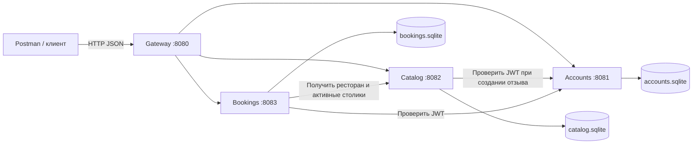
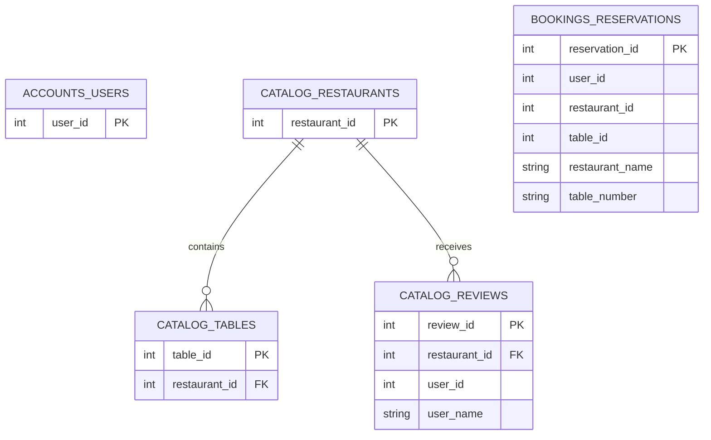
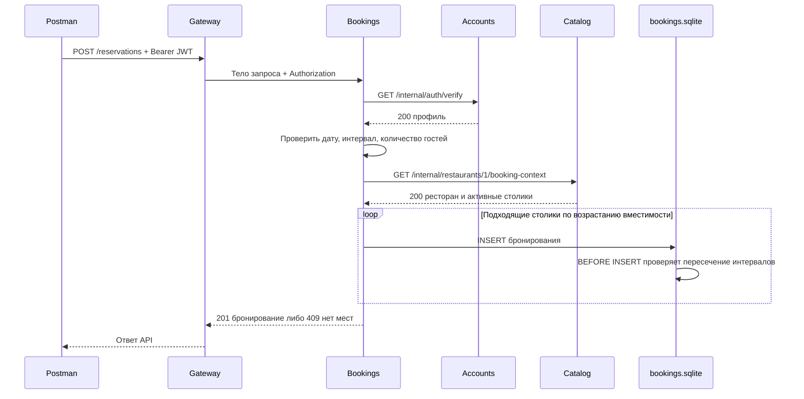

# ДЗ4. Технический дизайн микросервисной архитектуры

Автор: Прель Александр, БР1.1. Вариант: бронирование столиков в ресторанах.

Документ относится к реализации [ЛР2](../../labs/lab2/README.md). Исходный монолит находится в `labs/lab1` на коммите `922eba1`. Это локальная учебная система на Node.js, TypeScript, Express, TypeORM и SQLite.

Отчёт для сдачи: [ДЗ4_Прель Александр_БР1.1.pdf](ДЗ4_Прель%20Александр_БР1.1.pdf).

## Задача и критерии готовности

| Пункт задания | Решение и проверяемый результат |
| --- | --- |
| 1. Разделить монолит, database-per-service | Accounts, Catalog, Bookings работают отдельными процессами с тремя файлами SQLite |
| 2. Показать архитектуру и взаимодействия | Диаграммы ниже; синхронный HTTP/JSON, клиент обращается через Gateway |
| 3. Разделить БД | Таблица владения данными и схема связей ниже; межбазовых FK и JOIN нет |
| 4. Описать внутренние endpoints в OpenAPI | [internal-api.yaml](internal-api.yaml), два внутренних GET-метода |
| 5. Описать запросы, ответы и ошибки | Схемы и примеры в OpenAPI, политика отказов ниже |
| 6. Сформулировать требования и шаги перехода | Последовательность реализации, перенос данных и критерии приёмки ниже |

## 1. Границы сервисов

| Компонент | Ответственность | Публичные маршруты | База | Порт по умолчанию |
| --- | --- | --- | --- | --- |
| Gateway | Маршрутизация, единая точка входа, готовность системы | `/health`, `/ready`, перенаправление групп API | Нет | 8080 |
| Accounts | Регистрация, вход, JWT, профиль | `/auth/*`, `/users/*` | `accounts.sqlite` | 8081 |
| Catalog | Поиск ресторанов, кухни, столики, меню, фото, отзывы, рейтинг | `/restaurants/*`, `/cuisines/*` | `catalog.sqlite` | 8082 |
| Bookings | Выбор свободного столика, создание, история, отмена | `/reservations/*` | `bookings.sqlite` | 8083 |

У сервисов один исходный репозиторий и один lockfile в `lab2`, но разные точки входа и независимые процессы. `shared` содержит только HTTP, ошибки, конфигурацию и технические функции: в нём нет общих сущностей или подключения ко всем БД. Каждый сервис импортирует только собственный `data-source.ts`.

Вход и профиль принадлежат одному сервису, потому что используют одну запись пользователя. Отзывы оставлены в Catalog: их чтение и расчёт рейтинга нужны каталогу. Отдельный сервис отзывов добавил бы сетевой вызов для каждого просмотра ресторана без необходимой для этого задания пользы.

Все процессы слушают только `127.0.0.1`. Программа `npm run setup` подбирает свободные порты; фактические значения записываются в локальный `.env`. Внешние сетевые адреса межсервисных зависимостей в этой учебной версии запрещены конфигурацией.

## 2. Разделение данных

| Таблица монолита | Владелец | Что меняется |
| --- | --- | --- |
| `users` | Accounts | Удаляются обратные ORM-связи с бронированиями и отзывами |
| `restaurants`, `cuisines`, `restaurant_cuisines` | Catalog | Локальные связи сохраняются |
| `tables` | Catalog | Локальная связь с рестораном остаётся, связь с Reservation убирается |
| `menu_categories`, `menu_items`, `restaurant_photos` | Catalog | Локальные FK сохраняются |
| `reviews` | Catalog | `user_id` становится внешним логическим ID; добавляется `user_name` |
| `reservations` | Bookings | `user_id`, `table_id`, `restaurant_id` становятся логическими ID; сохраняются `restaurant_name`, `table_number` |

Логический ID является обычным числом, без внешнего ключа в чужую базу. Например, Bookings не может сделать SQL JOIN с Accounts. Он получает сведения о пользователе через HTTP.

На схеме FK показаны только внутри Catalog. Полная схема исходных сущностей остаётся в ДЗ1, поля описаны в `src/*/entities`.

### Снимки данных

Имя автора отзыва берётся из Accounts при создании отзыва и сохраняется как `user_name`. Переименование пользователя не меняет подпись старого отзыва. Название ресторана и номер столика сохраняются при бронировании. Историю можно читать даже при недоступном Catalog. Это осознанное изменение семантики относительно живых ORM-связей ЛР1.

Accounts остаётся источником истины для профиля; Catalog для ресторанов и столиков; Bookings для занятости столиков. Проверку доступности нельзя размещать одновременно в двух сервисах.

Удаление пользователей, ресторанов и столиков не входит в существующий API. При его добавлении потребуется отдельная политика: архивирование объектов, уведомление потребителей и сохранение истории. Межсервисное каскадное удаление не имитируется.

## 3. Внутренний API

Полный контракт с форматами всех полей: [internal-api.yaml](internal-api.yaml).

| Метод | Кто вызывает | Назначение | Успешный ответ |
| --- | --- | --- | --- |
| `GET Accounts/internal/auth/verify` | Catalog, Bookings | Проверить Bearer JWT и существование пользователя | `200`, профиль без пароля и хеша |
| `GET Catalog/internal/restaurants/{restaurantId}/booking-context` | Bookings | Проверить ресторан и получить активные столики | `200`, ID и название ресторана, часы работы, массив столиков |

У обоих запросов нет тела. Обязателен заголовок `X-Service-Key`. Для проверки JWT дополнительно обязателен `Authorization: Bearer <token>`. Секретные значения отсутствуют в репозитории и примерах.

Внутренние маршруты не проксируются Gateway. Передаваемые клиентом `X-Service-Key` и `X-User-Id` шлюз не пересылает. Bookings и Catalog не доверяют клиентскому ID пользователя.

Accounts проверяет JWT с алгоритмом HS256, issuer `restaurant-accounts`, audience `restaurant-api`, сроком действия 3600 секунд. Catalog и Bookings запрашивают текущий профиль у Accounts. Это упрощает отзыв доступа через отсутствие пользователя, но делает защищённые операции зависимыми от доступности Accounts.

`SERVICE_KEY` является общим ключом для локальной учебной сети. Это не отдельные удостоверения сервисов и не замена mTLS для production. Локальный `.env` доступен процессам одного пользователя macOS; разделение здесь реализовано на уровне процессов, моделей, БД и протокола, а не отдельных системных аккаунтов.

## 4. Создание бронирования

Нельзя полагаться только на последовательность SELECT свободного столика, затем INSERT: параллельные запросы могут одновременно увидеть свободное место. В Bookings проверка пересечения выполняется триггером SQLite в момент записи. Он также действует при UPDATE и после перезапуска сервиса. Интервалы считаются полуоткрытыми: `[18:00, 20:00)` не конфликтует с `[20:00, 21:00)`.

Сетевые запросы выполняются до записи. Распределённая транзакция не требуется: создание бронирования изменяет только одну БД. Отмена выполняет условный UPDATE собственной записи из `pending`/`confirmed` в `cancelled`.

Изменение вместимости или активности столика между получением контекста и записью не синхронизируется: API управления столиками пока отсутствует. При его добавлении потребуется версия контекста или отдельный протокол резервирования.

## 5. Ошибки и устойчивость

Единый формат: `{"error":{"code":"SERVICE_UNAVAILABLE","message":"Зависимый сервис недоступен."}}`.

| HTTP | Код | Причина |
| --- | --- | --- |
| 400 | `BAD_REQUEST` | Неправильный параметр пути или синтаксис JSON |
| 401 | `UNAUTHORIZED` | Нет пользовательского токена, он недействителен, пользователь отсутствует либо неверен сервисный ключ |
| 403 | `FORBIDDEN` | Попытка чтения или отмены чужого бронирования |
| 404 | `NOT_FOUND` | Ресторан, бронирование или маршрут отсутствует |
| 409 | `CONFLICT` | Email занят, свободных мест нет, отмена уже выполнена |
| 413 | `BAD_REQUEST` | JSON-тело превышает 64 КБ |
| 422 | `VALIDATION_ERROR` | Поля запроса не прошли проверку; возвращается массив `details` |
| 500 | `INTERNAL_SERVER_ERROR` | Непредвиденная ошибка сервиса |
| 503 | `SERVICE_UNAVAILABLE` | Соединение не установлено, неверный ответ зависимости либо SQLite занят после ожидания |
| 504 | `UPSTREAM_TIMEOUT` | Зависимый сервис не ответил за отведённое время |

Межсервисный HTTP-запрос ограничен 2 секундами; Gateway ожидает до 6,5 секунд, чтобы два последовательных внутренних запроса успели вернуть осмысленную ошибку. Автоматических повторов записи нет. При потере ответа после успешной записи клиент проверяет историю перед повтором; идемпотентный ключ пока не реализован.

`/health` каждого процесса проверяет сам процесс и его БД. `/ready` Gateway проверяет три зависимости и возвращает `200 ok` или `503 degraded` с состоянием каждой. При недоступном Catalog остаются доступны профиль и история бронирований. При недоступном Accounts каталог можно читать, но защищённые операции возвращают 503, а не ошибочное 401.

## 6. Последовательность перехода от ЛР1 к ЛР2

1. Зафиксировать внешний контракт ДЗ2 и комплексный Postman-сценарий ДЗ3.
2. Создать `labs/lab2`, перенести конфигурацию TypeScript и зависимости с существующим lockfile.
3. Выделить Accounts: User, регистрацию, вход, профиль; убрать ORM-связи в другие сервисы.
4. Выделить Catalog: ресторанные сущности и маршруты; заменить связь отзыва с User на ID и снимок имени.
5. Выделить Bookings: свою Reservation с логическими ID и снимками; добавить проверку пересечений в БД.
6. Реализовать внутренние HTTP-методы по OpenAPI и проверку сервисного ключа.
7. Заменить обращения к чужим репозиториям HTTP-вызовами с таймаутами.
8. Добавить Gateway с прежними публичными путями. Внутренние методы исключить из маршрутизации.
9. Подготовить три новые базы и независимый начальный каталог. Пользователи и бронирования появляются через API.
10. Проверить исходный сценарий, ошибки, доступ к чужим данным, параллельное бронирование, отказы и перезапуски.
11. Сопоставить физические таблицы и внешние ключи с распределением ответственности.
12. Сохранить команды запуска, фактические результаты тестов и отчёт ЛР2.

### Если понадобится перенести существующие данные

Текущая реализация запускается на новых базах и не переносит пользовательскую БД ЛР1 автоматически. План отдельного переноса:

1. Остановить запись в исходную систему на время согласованного окна и сделать согласованный снимок SQLite.
2. Открыть снимок только на чтение. Работать с новыми целевыми файлами; не модифицировать исходный.
3. Перенести `users` в Accounts с исходными ID и хешами паролей.
4. Перенести каталог с исходными ID и локальными FK. Для отзывов получить имя автора из снимка и заполнить `user_name`.
5. Перенести бронирования, вычислив `restaurant_id`, `restaurant_name`, `table_number` через таблицы исходного снимка.
6. Проверить количество строк, логические ссылки, `PRAGMA foreign_key_check` в Catalog, даты и пересечения активных бронирований. Конфликты не удалять автоматически.
7. Запустить сервисы на копиях, выполнить интеграционные проверки, затем переключить клиент на Gateway.

В ЛР2 применены новые JWT issuer/audience и новый секрет: старые токены ЛР1 требуют повторного входа. Откат переключением клиента возможен только до новых записей в микросервисах; после них требуется обратная сверка данных.

## 7. Критерии приёмки и ограничения

Готовность подтверждается успешными `npm run typecheck`, `npm run build`, `npm test`, `npm run test:postman`. В интеграционных тестах используются случайные порты и временные базы. Проверяется, что Accounts имеет только `users`, Bookings только `reservations`, а Catalog не содержит `users` и `reservations`.

ЛР1 сохраняется для сравнения. Брокер сообщений, Docker, удалённое развёртывание и CI/CD относятся к следующим заданиям. Внешний API сохраняет поля ДЗ2; новые ошибки 503/504 и семантика снимков описаны здесь. Наличие всех тестов не является подтверждением production-готовности: TypeORM `synchronize` используется только для учебных БД, пагинация каталога пока выполняется в памяти.

## Источники

- [Задания курса](../../../../README.md), разделы ДЗ3, ДЗ4, ЛР2.
- [Шаблон отчёта преподавателя](https://docs.google.com/document/d/1aAUawxv6_5k_Na7bLqrfUFANodyl89uPHXY4IKXS8WE/edit): титульный лист, задача, ход работы, вывод.
- [Node.js: fetch и AbortSignal](https://nodejs.org/api/globals.html#fetch).
- [TypeORM: транзакции](https://typeorm.io/docs/advanced-topics/transactions/).
