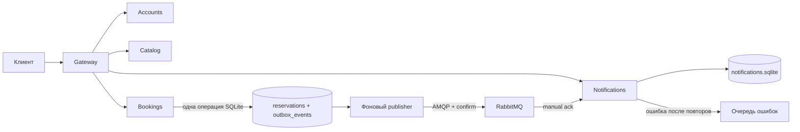

# ДЗ5. Межсервисное взаимодействие через RabbitMQ

Обновление ЛР3: этот функционал также собран и проверен в [полном Docker Compose-стенде](../../labs/lab3/README.md) на `http://127.0.0.1:8090`. Ниже сохранён отдельный способ запуска ДЗ5 непосредственно на Mac.

Дата проверки: 10.09.2026. Реализация развивает ЛР2 в `../../labs/lab2`; исходный монолит ЛР1 сохранён.

## Выполнение задания

| Пункт задания | Реализация | Подтверждение |
| --- | --- | --- |
| Подключить и настроить RabbitMQ или Kafka | Локальный RabbitMQ 4.3.5, собственный пользователь и vhost, durable exchanges и quorum queues, постоянный Docker volume | `npm run broker:start`, реальные тесты перезапуска брокера |
| Реализовать межсервисное взаимодействие через брокер | Bookings публикует создание и отмену брони; отдельный Notifications читает события и сохраняет уведомления в собственной SQLite | 10 интеграционных тестов AMQP и HTTP smoke-тест |
| Подготовить отчёт | Этот документ, контракт API, протокол проверки и PDF | [TEST_RESULTS.md](TEST_RESULTS.md), [openapi.yaml](openapi.yaml), [ДЗ5_Прель Александр_БР1.1.pdf](ДЗ5_Прель%20Александр_БР1.1.pdf) |

Уведомление здесь - запись, которую пользователь читает через API. Реальные email и SMS не отправляются. Kafka не используется: для задания достаточно одного брокера. Analytics и события регистрации/отзывов не реализованы.

## Что происходит по шагам



1. Клиент отправляет `POST /reservations`. Проверка пользователя и получение столиков по HTTP остаются как в ЛР2.
2. Bookings записывает бронь. SQLite-триггер в той же операции добавляет событие в `outbox_events`. Либо сохраняются обе записи, либо ни одна.
3. Клиент получает `201`. Он не ждёт доступности брокера или доставки уведомления.
4. Фоновый publisher берёт самое раннее неопубликованное событие и отправляет его RabbitMQ.
5. Только после publisher confirm заполняется `published_at`. Если подтверждение потерялось, запись будет отправлена повторно.
6. Notifications получает событие, проверяет его и записывает уведомление в свою базу. `event_id` - первичный ключ; повторная доставка делает `ON CONFLICT DO NOTHING`.
7. Consumer отправляет `ack` только после успешной записи. После этого RabbitMQ может убрать доставку из основной очереди.
8. Клиент читает `GET /notifications/me` с JWT. Там только его записи. Отмена брони запускает аналогичный путь с `reservation.cancelled`.

**Почему нельзя просто послать сообщение после сохранения брони?** Между двумя действиями программа может остановиться: бронь уже есть, сообщения нет. Outbox закрывает это окно за счёт общей операции SQLite. Между базами разных сервисов общей транзакции нет.

**Почему нужна защита от дубликатов?** Consumer мог записать уведомление и остановиться до `ack`. RabbitMQ доставит сообщение снова. Один и тот же `eventId` не создаёт вторую запись.

## Контракт событий

Exchange: `<RABBITMQ_NAMESPACE>.events`, тип `topic`. Routing keys и поле `type`:

| Событие | Когда создаётся | `data.status` |
| --- | --- | --- |
| `reservation.created` | Успешный INSERT подтверждённой брони | `confirmed` |
| `reservation.cancelled` | Успешный переход из pending/confirmed в cancelled | `cancelled` |

Конфликт бронирования и повторная отмена не создают событий. Пример с вымышленными данными:

```json
{
  "eventId": "aaaaaaaaaaaaaaaaaaaaaaaaaaaaaaaa",
  "schemaVersion": 1,
  "type": "reservation.created",
  "occurredAt": "2032-01-01T12:00:00.000Z",
  "data": {
    "reservationId": 1,
    "userId": 2,
    "restaurantId": 1,
    "restaurantName": "La Piazza",
    "tableId": 3,
    "tableNumber": "A3",
    "reservationDate": "2032-01-02",
    "startTime": "18:00:00",
    "endTime": "20:00:00",
    "guestsCount": 6,
    "status": "confirmed"
  }
}
```

`eventId` генерируется SQLite как 16 случайных байт в hex. AMQP `messageId` обязан совпадать с ним, routing key - с `type`. Схема проверяется в `src/messaging/events.ts`: размер до 64 КБ, версия 1, допустимый тип, положительные safe-integer ID и число гостей, названия длиной 1-255, существующая дата, время HH:mm:ss и начало раньше конца. Неизвестные дополнительные поля допускаются. JWT, email, пароль и сервисный ключ в событие не входят.

## Доставка, повторы и очередь ошибок

- Основная очередь: `<namespace>.notifications`, durable quorum. Publisher и consumer объявляют одинаковую топологию.
- Сообщения persistent; publisher ждёт confirm и использует `mandatory`, чтобы обнаружить отсутствие маршрута.
- Consumer использует `prefetch=1` и ручной `ack`.
- При разрыве соединения сервис переподключается с паузой 500 мс; URL использует heartbeat 2 секунды. Неподтверждённый outbox остаётся в SQLite.
- При ошибке записи consumer делает до 3 повторов с паузой 300 мс, то есть максимум 4 попытки обработки. Счётчик находится в `x-retry-count`.
- Сначала подтверждается публикация повтора, затем подтверждается исходная доставка. При разрыве возможны дубликаты, но не намеренное удаление необработанного события.
- Неверный формат сразу отправляется в dead-letter exchange `<namespace>.dead` и очередь `<namespace>.notifications.dead` с `x-error=INVALID_EVENT`.
- Исчерпанные повторы попадают туда же с `x-error=PROCESSING_FAILED`. Публикация в эту очередь тоже подтверждается брокером. Это реализованный приложением маршрут ошибок, не автоматическая DLX policy брокера.

Гарантия - **at-least-once с идемпотентной записью уведомления**, не exactly-once. После отказа уведомления появляются с задержкой. Повторы могут изменить порядок доставки; API показывает отдельные события, а не строит из их порядка текущее состояние брони.

Для восстановления из очереди ошибок сначала исправляют причину, затем через RabbitMQ Management получают сообщение с возвратом в очередь, изучают `x-error` и публикуют исправленное сообщение в основной exchange. Нужно сохранить `messageId=eventId`, правильный routing key, включить persistent и сбросить счётчик повторов. Исходную запись ошибки удаляют только после проверки результата. Автоматического бесконечного replay нет. Не используйте Purge для диагностики: это удаляет сообщения. Тест `storage failure...` проверяет восстановление после устранения причины программно.

## Локальный запуск на Mac

Требуются Node.js 22+ (проверено 24.14.0), npm (11.9.0), установленный и запущенный Docker Desktop. Скрипт находит Docker в `/Applications/Docker.app/Contents/Resources/bin`, даже если команда отсутствует в PATH. Приложение не публикуется в интернете.

```bash
cd "БР1.1/Прель Александр/labs/lab2"
npm ci --include=dev
npm run setup:messaging
npm run broker:start
npm run typecheck
npm run build
npm run start:messaging
```

`setup:messaging` создаёт `.env.hw5` с правами 0600, случайными секретами, отдельным каталогом `data/hw5-*` и пятью свободными портами. Уже существующий файл сохраняется. Прежний `.env` ЛР2 и базы ЛР1 не перезаписываются. `broker:start` записывает в `.env.hw5` только адрес соединения и management-порт своего брокера.

Образ закреплён не только тегом, но и digest в `scripts/docker.cjs`. Docker получает отдельный именованный volume и лимиты 512 МБ / 1 CPU. Это локальный одноузловой стенд, не кластер высокой доступности.

Выбранные порты закрепляются в контейнере, чтобы не менялись после `stop/start`. Все опубликованные порты привязаны к `127.0.0.1`. Если порт после настройки занял другой процесс, запуск завершится ошибкой: чужой процесс не останавливается. Для API измените соответствующий `*_PORT` в `.env.hw5`; для брокера требуется отдельная перенастройка привязок, без удаления его данных.

Фактический стенд 10.09.2026:

| Компонент | Адрес |
| --- | --- |
| Gateway, основной API ДЗ5 | `http://127.0.0.1:8084` |
| Accounts | `http://127.0.0.1:8085` |
| Catalog | `http://127.0.0.1:8086` |
| Bookings | `http://127.0.0.1:8087` |
| Notifications | `http://127.0.0.1:8088` |
| RabbitMQ AMQP | `127.0.0.1:53277` |
| RabbitMQ Management | `http://127.0.0.1:53278` |

На другом запуске настройки могут выбрать другие свободные порты. Учётные данные RabbitMQ находятся только в локальном `.env.hw5`; не отправляйте этот файл в Git. Прежний стек ЛР2 на 8080-8083 не останавливался.

`GET /health` проверяет Gateway, `GET /ready` - четыре сервиса и их подключения к RabbitMQ. При недоступном брокере `/ready` отвечает 503, но создание и отмена брони продолжают работать через outbox. На `/` по-прежнему ожидается 404: frontend не создавался.

```bash
curl http://127.0.0.1:8084/health
curl http://127.0.0.1:8084/ready
curl http://127.0.0.1:8084/restaurants
```

## Проверки и остановка

Из второго терминала в `labs/lab2`:

```bash
npm test
npm run test:messaging
npm run test:postman:messaging
npm run test:smoke:messaging
npx --yes @apidevtools/swagger-cli@4.0.4 validate ../../homeworks/hw5/openapi.yaml
```

`npm test`: 17 HTTP-интеграционных сценариев и 5 тестов валидатора событий. `test:messaging`: 10 сценариев с собственным временным RabbitMQ, временными базами и портами. Он останавливает и удаляет только свои ресурсы. Два последних прогона обращаются к работающему стенду и оставляют в его тестовых базах пользователей, отзывы, отменённые брони и уведомления; секреты не печатаются.

Остановка процессов API на Mac из другого терминала: `npm run stop:messaging`. Скрипт сверяет точную команду супервизора и путь текущей копии, не останавливает процессы по номеру порта. При ручном запуске можно нажать `Ctrl-C` в его терминале. Остановка только своего брокера с сохранением данных:

```bash
npm run broker:stop
```

Повторный запуск: `npm run broker:start`, затем `npm run start:messaging`. После изменения TypeScript сначала `npm run build`. Не нужно удалять `.env.hw5`, SQLite-файлы или Docker volume. Отдельный запуск любого процесса ДЗ5: `node --env-file=.env.hw5 dist/<service>/index.js`, где service - accounts, catalog, bookings, notifications или gateway.


## Карта кода для чтения

| Файл в labs/lab2 | Что изучить |
| --- | --- |
| `src/bookings/routes.ts` | HTTP-запросы создания и отмены |
| `src/bookings/outbox.ts` | Атомарная запись события триггером и фоновая отправка |
| `src/bookings/entities/OutboxEvent.ts` | Таблица журнала отправки |
| `src/messaging/events.ts` | Тип события и проверка входных данных |
| `src/messaging/rabbit.ts` | Соединение, очереди, confirms, переподключение |
| `src/notifications/consumer.ts` | Получение, запись, ack, retries и DLQ |
| `src/notifications/Notification.ts` | Независимая модель уведомления |
| `src/notifications/index.ts` | Чтение своих уведомлений с JWT |
| `tests/messaging.integration.cjs` | Как воспроизводятся сбои и проверяется восстановление |

Общие типы событий - контракт, а не общая бизнес-база. Notifications не читает SQLite Bookings. Email и имя пользователя из Accounts для обработки события не нужны. При чтении уведомлений права проверяются через Accounts, как в остальных защищённых методах ЛР2.

## Ограничения и следующий этап

Работа проверена локально по перечисленным сценариям, но не является production-аттестацией. Нет отказоустойчивого кластера, TLS, ротации ключей, длительных нагрузочных тестов, idempotency-key HTTP, автоматической очистки outbox/уведомлений и DLQ. При потере локальных дисков данные могут быть утрачены. Повреждённая вручную запись outbox требует вмешательства; `/ready` проверяет связи, а не гарантирует отсутствие очереди неотправленных событий. Число ожидающих событий доступно Bookings через защищённый `GET /internal/messaging/status` с `X-Service-Key`; Gateway его не публикует.

Аудит npm выявляет 14 проблем в прежних зависимостях, включая одну critical. Их обновление требует отдельной работы и повторной проверки; `npm audit fix` не выполнялся. Все версии прежних пакетов сохранены. Добавлены только amqplib 0.10.9, его типы 0.10.8 и необходимые транзитивные пакеты.

Следующий после ДЗ5 этап ЛР3 уже реализован отдельно в `labs/lab3`: пять Dockerfile, общая Compose-сеть и сохранение баз в volumes. В описанном здесь самостоятельном режиме ДЗ5 в Docker работает только RabbitMQ, а пять Node.js-процессов - непосредственно на Mac. Полная контейнеризация запускается командами из README ЛР3.

## Источники

- [Требования курса](../../../../README.md), раздел 2.2, ДЗ5.
- [RabbitMQ: publisher confirms и consumer acknowledgements](https://www.rabbitmq.com/docs/confirms).
- [RabbitMQ: dead-letter exchanges](https://www.rabbitmq.com/docs/dlx).
- [amqplib: Channel API](https://amqp-node.github.io/amqplib/channel_api.html).
- [Официальный образ RabbitMQ](https://hub.docker.com/_/rabbitmq).
