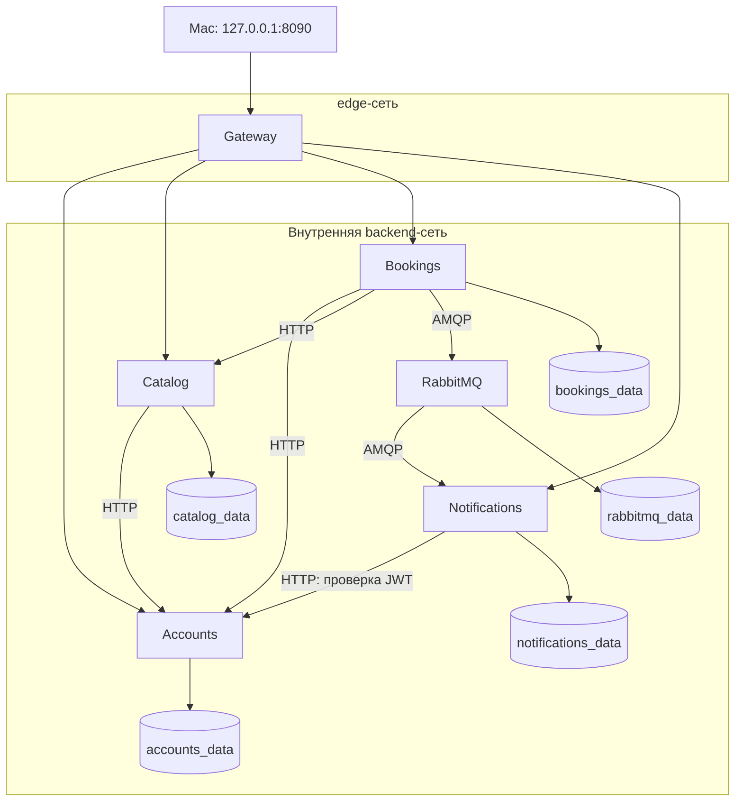

# ЛР3. Контейнеризация микросервисов

Проверено 10.09.2026 на macOS arm64. Основной локальный API: **http://127.0.0.1:8090**. На `/` ожидается JSON 404, это backend без frontend. Проверка готовности: `/ready`.

ЛР3 упаковывает существующие сервисы ЛР2 и ДЗ5 в Docker. Бизнес-код остаётся в соседней папке `../lab2`; копия приложения и новый набор зависимостей не создаются. Монолит ЛР1 не входит в этот Compose-проект и проверяется отдельно.

## Выполнение задания

| Пункт курса | Реализация |
| --- | --- |
| Dockerfile для каждого сервиса | `docker/accounts.Dockerfile`, `catalog.Dockerfile`, `bookings.Dockerfile`, `notifications.Dockerfile`, `gateway.Dockerfile` |
| Общий docker-compose.yml | Шесть контейнеров: пять Node.js-сервисов и официальный RabbitMQ |
| Сетевое взаимодействие | Docker DNS, внутренняя backend-сеть, отдельная edge-сеть только для Gateway |
| Отчёт | Этот README, [TEST_RESULTS.md](TEST_RESULTS.md) и [ЛР3_Прель Александр_БР1.1.pdf](ЛР3_Прель%20Александр_БР1.1.pdf) |

## Запуск на Mac

Нужны установленный и запущенный Docker Desktop, Node.js 22+ и npm для вспомогательных команд. Фактически проверены Node.js 24.14.0, npm 11.9.0 и Docker Compose 5.5.1. Скрипты находят Docker в `/Applications/Docker.app/Contents/Resources/bin`, даже если он не добавлен в PATH. Глобальные настройки не изменяются.

```bash
cd "БР1.1/Прель Александр/labs/lab3"
npm run setup
npm run config:check
npm run build
npm start
npm run status
```

В этой папке нет npm-зависимостей: локальный `npm install` не нужен. Установка приложения из `../lab2/package-lock.json` выполняется внутри Linux-стадии Docker-сборки через `npm ci --include=dev`. Для первой сборки нужен доступ к официальным реестрам Docker/npm и Debian. Образы не отправляются в registry.

`setup` создаёт `.env.compose` с правами 0600, случайными секретами, уникальным именем Compose-проекта и свободным портом из диапазона 8090-8199. Существующая конфигурация сохраняется. Данные ЛР1 и локальной ЛР2/ДЗ5 не читаются и не перезаписываются.

`npm start` выполняет `docker compose up --detach --wait`: команда заканчивается, а контейнеры продолжают работать в Docker. Закрытие терминала не останавливает этот стенд. После перезапуска Docker автоматически возвращаются контейнеры, которые не были остановлены вручную, согласно `restart: unless-stopped`. Запуск самого Docker Desktop вместе с macOS не настраивался.

```bash
curl http://127.0.0.1:8090/health
curl http://127.0.0.1:8090/ready
curl http://127.0.0.1:8090/restaurants
```

Если порт уже занят после подготовки конфигурации, измените только `API_PORT` в `.env.compose` и повторите `npm start`. Скрипты не останавливают чужие процессы. Если установленная версия Compose не поддерживает `--wait`, потребуется обновление Docker Desktop с разрешения владельца компьютера.

## Остановка и повседневная работа

Все команды ниже выполняются из `labs/lab3`:

| Команда | Действие |
| --- | --- |
| `npm start` | Запустить/обновить контейнеры в фоне, дождаться healthchecks |
| `npm run status` | Статусы контейнеров и опубликованные порты |
| `npm run logs` | Последние 80 строк логов, без бесконечного ожидания |
| `npm stop` | Остановить только этот Compose-проект, сохранить контейнеры и данные |
| `npm run down` | Удалить контейнеры и сети этого проекта, сохранить именованные тома |
| `npm run build` | Пересобрать образы после изменения исходников |

После изменения кода в `../lab2/src`: `npm run build`, затем `npm start`, затем тесты. Это обычная сборка TypeScript в JavaScript, не `tsx` и не hot reload.

Не удаляйте `.env.compose` для повторного запуска. В ней имя проекта и ключи существующих данных: другое имя создаст другие тома, другой JWT-secret сделает старые токены недействительными, а смена пароля RabbitMQ только в env не меняет пароль в уже инициализированном broker volume.

Не применяйте `down --volumes`, `docker volume prune` и `docker system prune` к рабочему стенду: они могут удалить данные. Единственное автоматическое удаление томов выполняет тестовый скрипт для своего нового одноразового проекта, а не для этого стенда.

## Архитектура



| Сервис | Адрес внутри Docker | Что доступно на Mac |
| --- | --- | --- |
| Gateway | `gateway:3000` | Только `127.0.0.1:8090` |
| Accounts | `accounts:3000` | Порт не опубликован |
| Catalog | `catalog:3000` | Порт не опубликован |
| Bookings | `bookings:3000` | Порт не опубликован |
| Notifications | `notifications:3000` | Порт не опубликован |
| RabbitMQ | `rabbitmq:5672`, management внутри `rabbitmq:15672` | Оба порта не опубликованы |

Почему теперь не `127.0.0.1:8081`? У каждого контейнера собственное сетевое окружение: его localhost указывает на него самого, а не на соседний сервис. Docker DNS разрешает имя `accounts` в текущий адрес контейнера Accounts. После пересоздания IP может измениться, имя остаётся прежним.

Приложение использует `APP_NETWORK_MODE=compose`, слушает `0.0.0.0` **внутри контейнера** и допускает только ожидаемые DNS-имена сервисов. В режиме по умолчанию `local` сохранены прежние ограничения на `127.0.0.1`. Свободные внешние HTTP/AMQP-хосты не разрешены конфигурацией приложения.

Сеть backend помечена `internal: true`. Только Gateway дополнительно подключён к edge-сети для публикации порта на Mac. Это локальный доступ, не размещение приложения в интернете. У Gateway технически есть исходящий сетевой доступ через edge; он не используется для внешних интеграций. Полной изоляцией от администратора Docker эта схема не является.

## Как устроен Dockerfile

Каждый из пяти Dockerfile содержит две стадии:

1. **build**: официальный Node.js 24.14.0 на Debian bookworm-slim; Linux-инструменты python3/make/g++; копирование package.json и lockfile; `npm_config_build_from_source=true npm ci --include=dev` для компиляции нативного sqlite3 под glibc этого образа; копирование исходников; `npm run typecheck`; `npm run build`; удаление dev-зависимостей из будущего runtime через `npm prune --omit=dev`.
2. **runtime**: тот же закреплённый базовый образ; production node_modules; скомпилированные файлы конкретного сервиса и общих модулей; каталог `/app/data`, принадлежащий пользователю node; `USER node`; проверка загрузки `require('sqlite3')` при сборке; прямой запуск `node dist/<service>/index.js`.

Системные build-инструменты не устанавливаются в macOS или финальный образ. Node.js-сервисы работают с UID 1000, а не root. Host node_modules с macOS не копируется: sqlite3 устанавливается для Linux arm64 внутри сборки. В базовом образе уже присутствует npm 11.9.0.

И Node.js, и RabbitMQ закреплены тегом и SHA256 digest в исходных файлах. Версии npm-пакетов берутся из lockfile без обновления во время сборки. 10.09.2026 lockfile адресно обновлён для исправления известных уязвимостей; [протокол](../lab2/DEPENDENCY_SECURITY.md). Debian-пакеты build-стадии берутся из актуального репозитория; побайтовая идентичность сборок во времени не заявляется.

Важно: готовый Linux arm64 бинарник sqlite3 6.0.1 не загрузился в bookworm (`GLIBC_2.38 not found`). Поэтому сборка из исходников обязательна для проверенного образа, а не просто запасной путь. Компиляторы остаются в build-стадии, на Mac не устанавливаются. Проверка загрузки драйвера в runtime не даёт успешно собрать образ с этой несовместимостью.

Файл `../lab2/.dockerignore` разрешает передавать в build context только package.json, package-lock.json, tsconfig.json и src. `.env`, `.env.hw5`, `.env.compose`, базы, host node_modules и Git-история в контекст не входят. Секреты передаются только при запуске контейнеров, не через Docker build args.

## Данные, права и здоровье

Каждый владелец данных имеет собственный named volume. Полные имена получают префикс из `.env.compose`, например `itmo-lab3-..._accounts_data`. SQLite хранится в `/app/data/<service>.sqlite`; RabbitMQ - в `/var/lib/rabbitmq`. Общей базы и общих SQLite-томов между сервисами нет. Host-каталоги с существующими базами не монтируются.

Сервисам Node.js заданы read-only root filesystem, writable volume только для собственной БД, временный `/tmp`, сброшенные capabilities и `no-new-privileges`. Gateway не имеет тома БД. Ограничены память, CPU, число процессов и размер логов. Готовый образ RabbitMQ использует собственный штатный запуск и не наследует все ограничения Node.js-контейнеров.

`/health` подтверждает работу процесса и SQL-проверку его БД. `/ready` Gateway проверяет четыре сервиса и соединения Bookings/Notifications с брокером. Внутренние `/health` не объявляют весь проект готовым при отказе RabbitMQ.

Compose использует `depends_on: condition: service_healthy` для порядка начального запуска. Это не механизм восстановления логики после отказа: AMQP-переподключение реализовано в приложении. `restart: unless-stopped` восстанавливает завершившийся процесс; один только статус `unhealthy` не приводит к автоматическому перезапуску. Ожидающие события сохраняются в outbox, как в ДЗ5.

## Тестирование

При уже собранных образах:

```bash
npm test
npm run test:postman
npm run test:smoke
```

- `npm test`: восемь сценариев на новом временном Compose-проекте, с отдельными секретами, свободным портом и пятью отдельными томами. Проверяются Linux/non-root, закрытые порты, HTTP, уведомления, конкурентное бронирование, аварийный рестарт, пересоздание контейнеров, сбой брокера, сохранность очереди и `down/up`. После прогона удаляются только ресурсы этого временного проекта.
- `test:postman`: существующая коллекция ДЗ3 на рабочем локальном стенде, 29 запросов и 117 assertions. Newman 6.2.2 запускается через npx; первая загрузка требует сеть. Данные тестовых пользователей остаются в томах.
- `test:smoke`: регистрация, вход, профиль, бронь, отмена, два уведомления владельцу; секреты в вывод не включаются. Записи тоже остаются в тестовых данных стенда.

Для регрессии режима без контейнеров из `../lab2` выполните `npm test` (28 тестов) и `npm run test:messaging` (10 AMQP-сценариев). Этот набор использует локальные Node.js-процессы и другой временный брокер, не контейнеры ЛР3.

Фактический итог после обновления зависимостей: **28/28 локальных тестов, 10/10 AMQP, 8/8 Compose, Newman 117/117**, подробности в [TEST_RESULTS.md](TEST_RESULTS.md). Это проверенные сценарии, не доказательство отсутствия всех возможных ошибок.

## Как писать этот этап с нуля

1. Добиться рабочего запуска без Docker. Контейнеризация не исправляет ошибочную бизнес-логику автоматически.
2. Определить процессы и владельцев данных. Здесь пять процессов приложения, один брокер и пять независимых хранилищ.
3. Написать Dockerfile одного сервиса: Linux-зависимости, обычная TypeScript-сборка, node-процесс. Проверить его отдельно.
4. Выделить runtime-стадию, убрать compiler/dev-зависимости и запуск от root; исключить секреты через dockerignore.
5. Подготовить отдельные Dockerfile остальных сервисов, сохраняя тот же проверенный порядок сборки.
6. Объединить сервисы в Compose, заменить localhost-вызовы на имена Docker DNS.
7. Добавить тома, healthchecks, порядок запуска и безопасную публикацию только Gateway.
8. Проверить обычный пользовательский путь, затем аварии, рестарты и сохранение данных.
9. Описать воспроизводимые команды и ограничения. Только после этого переходить к следующей учебной работе.

## Ограничения

Это один локальный Docker Engine, не production-кластер. Нет TLS, внешнего reverse proxy, бэкапов/restore-проверки, миграций вместо TypeORM synchronize, ротации ключей и очистки накопленного outbox. Том переживает удаление контейнера, но не заменяет резервную копию при потере Docker-диска. Администратор Docker может прочитать env контейнеров; `.env.compose` нельзя отправлять в Git или отчёты.

После отдельного обновления зависимостей 10.09.2026 полный и production `npm audit` рабочей lab2 показывают 0 вместо 14 затронутых пакетов. `npm audit fix` не использовался. Этот результат не включает историческую lab1, системные пакеты образов и отдельно загружаемые инструменты; полноценное сканирование Linux-образов на CVE не выполнялось. Драйвер sqlite3 объявлен неподдерживаемым: риск сопровождения сохраняется. [Подробности и источники](../lab2/DEPENDENCY_SECURITY.md).

ЛР3 реализована и проверена локально. Принятие работ преподавателем не подтверждается автоматическими тестами.

PDF фиксирует первоначальный этап ЛР3 до обновления зависимостей. Актуальный протокол: [проверка зависимостей](../lab2/DEPENDENCY_SECURITY.md).

## Источники

- [Требования курса, раздел ЛР3](../../../../README.md).
- [Docker: сетевое взаимодействие Compose](https://docs.docker.com/compose/how-tos/networking/).
- [Docker: определения сетей](https://docs.docker.com/reference/compose-file/networks/).
- [Docker: порядок запуска](https://docs.docker.com/compose/how-tos/startup-order/).
- [Docker: параметры сервисов](https://docs.docker.com/reference/compose-file/services/).
- [Docker: рекомендации по сборке](https://docs.docker.com/build/building/best-practices/).
- [Docker: build context и dockerignore](https://docs.docker.com/build/concepts/context/).
